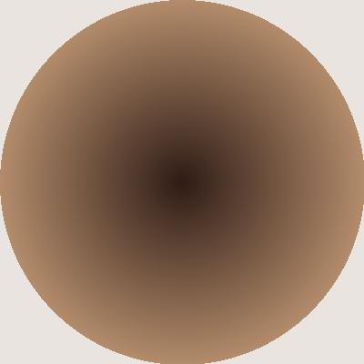
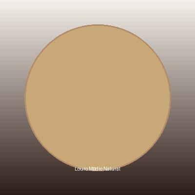
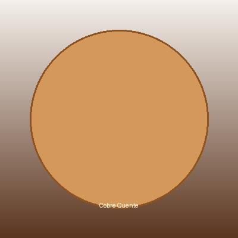
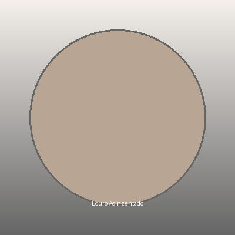
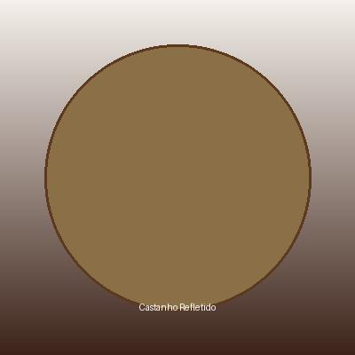

# 🎨 Guia: Adicionar Identidade Visual da Eliane

## 1️⃣ FOTOS DA ELIANE

### Onde adicionar:
```
assets/images/
├── eliane-profile.jpg (foto perfil - 300x300px recomendado)
├── eliane-gallery-1.jpg (galeria - 400x400px)
├── eliane-gallery-2.jpg
├── eliane-gallery-3.jpg
└── eliane-gallery-4.jpg
```

### Como adicionar na ferramenta:

**Edite `index.html` no header:**
```html

```

**Ou crie uma galeria na seção de vídeos:**
Adicione após a linha de vídeos em `index.html`:
```html
<div class="gallery-section">
    <h3>Conheça a Eliane</h3>
    <div class="gallery-grid">
        
        
        
        
    </div>
</div>
```

---

## 2️⃣ CORES EXATAS DA MARCA

### Arquivo a editar:
`css/theme.css` - seção `:root`

### Valores a substituir:
Procure por estes comentários e substitua com valores do Google Drive:

```css
:root {
    /* PRIMARY COLORS - Substitua com cores exatas do Manual de Marca */
    --color-primary: #1a1a1a;              /* ALTERAR - Preto da marca */
    --color-primary-light: #2d2d2d;        /* ALTERAR - Cinza da marca */
    --color-secondary: #D4A574;            /* ALTERAR - Cor principal (Louro/Dourado) */
    --color-secondary-light: #E8C9A0;      /* ALTERAR - Variação clara */

    /* ACCENT COLORS - Cores de destaque */
    --color-accent-warm: #c85d5d;          /* ALTERAR - Vermelho morno */
    --color-accent-cool: #7a9b8e;          /* ALTERAR - Verde/Teal */
    --color-accent-gold: #c9a961;          /* ALTERAR - Ouro premium */
}
```

### Como obter os valores:

1. Abra Google Drive: https://drive.google.com/drive/u/1/folders/1o_5xNiccI8pTrb8KPwU_UdUzCAqALsKw
2. Baixe: `RGB.pdf`, `CMYK.pdf`, `Manual de Marca`
3. Extraia os valores HEX/RGB
4. Cole aqui em `css/theme.css`

**Exemplo de como deve ficar:**
```css
:root {
    --color-primary: #1F1F1F;              /* Preto exato da marca */
    --color-secondary: #D9A36B;            /* Louro/Ouro exato */
    --color-accent-warm: #C97A5C;          /* Vermelho exato */
}
```

---

## 3️⃣ LOGO PROFISSIONAL

### Logo atual:
- ✅ `assets/icons/logo.png` - Logo automático criado
- ✅ `assets/icons/favicon.png` - Favicon gerado

### Substituir com logo real:

Se tiver logo em alta qualidade da Eliane:

1. **Copie para:**
   ```
   assets/images/logo-eliane.png
   assets/images/logo-eliane-white.png (versão branca)
   ```

2. **Atualize HTML:**
   ```html
   
   ```

### Recomendações:
- Tamanho: 200x200px mínimo (pode ser maior)
- Formato: PNG transparente (melhor) ou JPG
- Cores: Respeitar identidade visual

---

## 4️⃣ TIPOGRAFIA EXATA

### Fonte atual:
- ✅ **Montserrat** (via Google Fonts)

### Se usar outra fonte:

Edite `index.html` na seção `<head>`:
```html
<!-- Substituir link Google Fonts -->
<link href="https://fonts.googleapis.com/css2?family=SUA_FONTE:wght@300;400;600;700&display=swap" rel="stylesheet">
```

E depois em `css/typography.css`:
```css
body {
    font-family: 'SUA_FONTE', sans-serif;
}
```

---

## 5️⃣ CHECKLIST IDENTIDADE VISUAL

- [ ] Cores exatas do Google Drive extraídas
- [ ] `css/theme.css` atualizado com cores reais
- [ ] Logo profissional em `assets/images/`
- [ ] Fotos da Eliane adicionadas em `assets/images/`
- [ ] HTML atualizado com paths corretos
- [ ] Favicon atualizado
- [ ] Tipografia verificada
- [ ] Página recarregada e testada

---

## 📝 INSTRUÇÕES RÁPIDAS

### Se tiver as FOTOS:
1. Copie para `assets/images/`
2. Atualize paths no `index.html`
3. Recarregue a página

### Se tiver as CORES EXATAS:
1. Abra `css/theme.css`
2. Substitua valores em `:root {}`
3. Recarregue a página

### Se tiver LOGO PROFISSIONAL:
1. Copie para `assets/images/`
2. Atualize `` no HTML
3. Recarregue

---

**Status Atual:**
- ✅ Logo automático criado
- ✅ Favicon gerado
- ✅ Estrutura pronta
- ⏳ Aguardando: Cores exatas + Fotos da Eliane

Assim que você fornecer essas informações, a ferramenta ficará 100% customizada! 🎨
